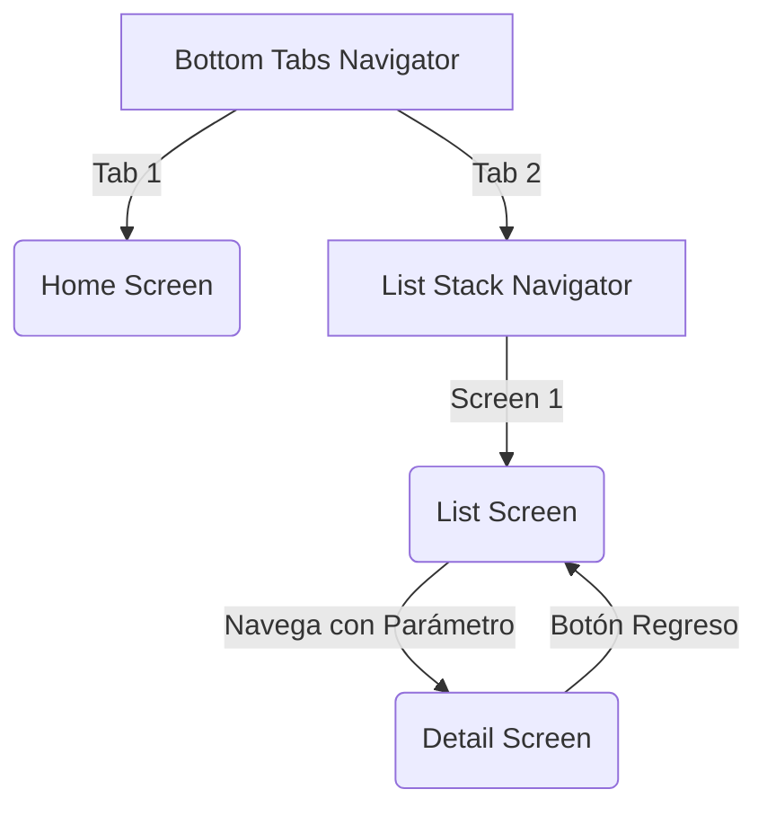

# Actividad - Navegación Anidada (Bottom Tabs + Stack)

## Diagrama de la Navegación

## Reflexión sobre Conflictos de Versiones

Durante la integración de múltiples navegadores en React Native, es común encontrarse con conflictos de versiones si los paquetes de `@react-navigation` y sus dependencias (como `react-native-screens` y `react-native-safe-area-context`) no están alineados. En este proyecto, el conflicto potencial de versiones se previno y resolvió asegurando que todas las bibliotecas de la familia React Navigation provengan de la misma versión principal (v6 en este caso).

Además, en proyectos con Expo, el uso del comando `npx expo install` es crucial. Este comando asegura que la versión instalada de los módulos nativos (`react-native-screens`, `react-native-safe-area-context`) sea compatible con la versión específica del SDK de Expo que está utilizando el proyecto (SDK 50+ en versiones recientes). Si se instalaran con `npm install` normal, podrían descargarse versiones incompatibles que causan errores en tiempo de ejecución o fallos al compilar.

## Capturas del Flujo

*(Añadir aquí las capturas de pantalla solicitadas: Pestañas → Lista → Detalle → Regreso)*

## Instrucciones para Ejecutar

1. Instalar dependencias: `npm install`
2. Iniciar el servidor de desarrollo: `npx expo start`
3. Abrir la aplicación en un emulador o dispositivo físico usando Expo Go.
